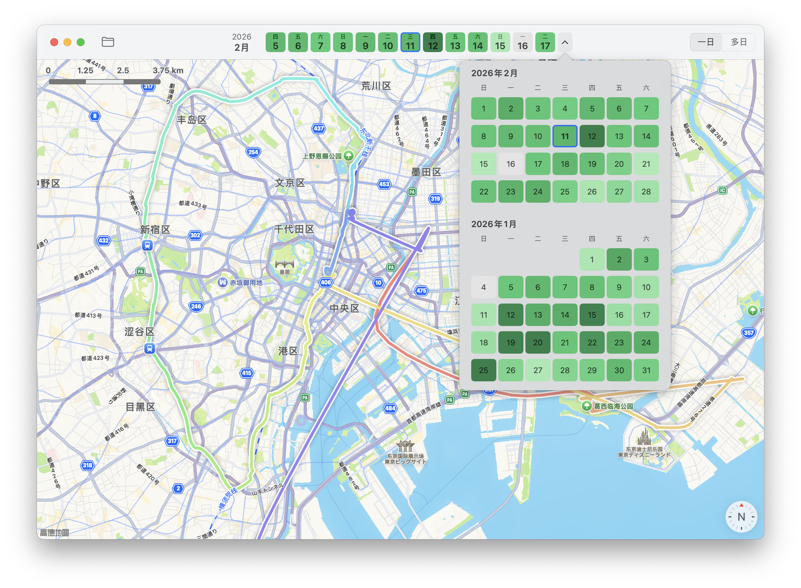

# 轨迹查看器 Track Viewer

一款 macOS 原生应用，用于可视化个人 GPS 轨迹数据，目前支持“一生足迹”生产的数据。

### 地图视图
- 基于 Apple MapKit，轨迹以平滑曲线渲染
- **一日模式**：Pastel 彩虹色（红→紫）按时间顺序为轨迹上色，鼠标悬停显示经纬度、高程、时间气泡
- **多日模式**：每天一种彩虹色，点击某天轨迹可切换至一日模式查看详情

